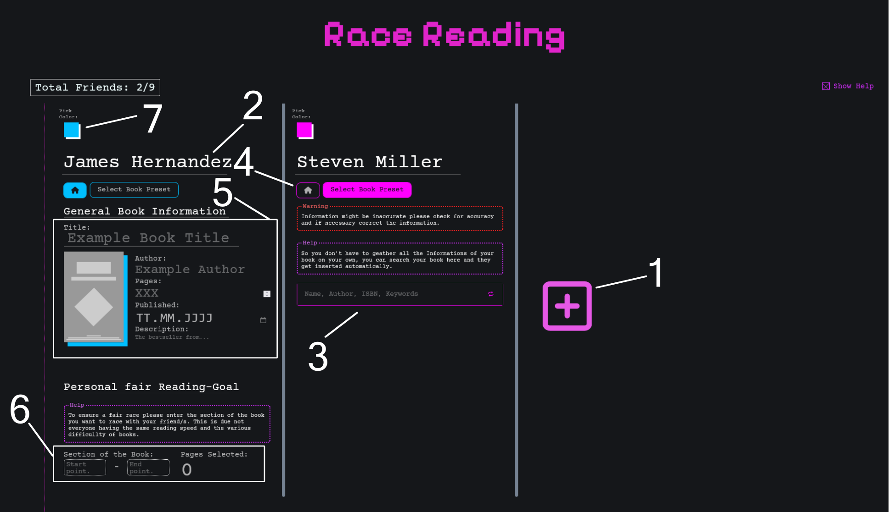

# Summer Race Reading

> [!IMPORTANT]
> This project is still a work in progress. It’s not fully finished yet, but the homepage can already be used.

> 💡 **Note:** This WebApp is being developed for the **Summer of Making** by **HackClub**.

---

## 🏁 What is it about

**Summer Race Reading** is a **web app** to motivate you and your friends to read by creating a **competition**. You and your friends can agree among yourselves on a **fair section** of your individual books that you want to read in the same time frame. Everyone then has to enter their **current page number** to give their friends **live updates**, and whoever finishes their section first **wins**.

## 📖 User Guide

### 🏠 Homepage Overview



Each friend you want to read with is represented by a **Friend Column**. These columns are separated by grey vertical lines.

---

### ➕ Adding a Friend

To add a new Friend Column, click the **pink “+” button** at the end of the Friend Columns (**ref. 1**).

---

### 🧍 Changing the Friend's Name

At the top of each column, you'll see a **randomly generated name** (**ref. 2**).  
You can change this name to one that matches your friend.

---

### 🔍 Selecting a Book

Each Friend Column has two tabs:

1. **Home** – lets you enter and edit information about the book.  
2. **Search Book Preset** – selected by default; allows you to search for a book preset.

#### 🔎 Option 1: Search for a Book

- By default, the **Search tab** is selected (**ref. 3**). If it isn’t, you can switch to it.
- Use this tab to **search for a book preset**, so you don’t have to enter all book details manually.
- Enter a keyword (e.g., book title), then select the appropriate result from the displayed list.

After selecting a book, you'll be **automatically redirected to the Home tab**, where you can **review and edit** the suggested data (**ref. 5**).

#### ✍️ Option 2: Enter Information Manually

- Click the **Home tab** (**ref. 4**).
- You'll find all input fields required to manually enter your book’s details.
- If you hover over the **book cover image**, an upload icon will appear – click it to upload your own cover.

---

### 🎯 Setting a Fair Reading Goal

At the bottom of each Friend Column (**ref. 6**), you'll find the **Personal Fair Reading Goal** section.

Here you can:

- Define which part of the book your friend should read.
- Ensure a fair competition, taking into account different reading speeds and book difficulties.

---

### 🎨 Changing the Friend Column Color

To change the color of a Friend Column:

- Click the **colored square** at the top of the column (**ref. 7**).
- Choose from the list of available colors.

💡 **Tip:** Colors that are already in use are marked with a **grey diagonal line**.  
If you choose one of them, the colors will be **swapped** between the two columns.

## Setup Instructions

> [!TIP]
> If you’re just here to try out the demo, use the demo provided on The Summer of Making Project page to test it quickly.

### Informations

- [Node.js](https://nodejs.org/) - **v22** (tested)
- The Fronted was written in React.
- The **backend** is written in plain JavaScript (Node.js), located in the `/api` folder.

Please your preferred way to run the two. The Backend **port** is **3001**. 

### 🌐 Environment Configuration

Please enter the Api-Key to the [Goolge Books API](https://developers.google.com/books/docs/v1/using#APIKey) (just the Api-Key) as

```bash
BOOK_API_KEY = ''
```

And then from [Cloudinary](https://cloudinary.com/) the Cloud Name, Cloud Secret and the Api-Key as

```bash
CLOUD_NAME = '' 
CLOUD_SECRET = '' 
CLOUD_API_KEY = ''
```

## 📊 Basic Progress Overview

### ✅ Finished

- Basic UI for selecting friends and their corresponding book
- Basic integration of the **Google Books API** for book search

---

### 🛠️ To Do

- Finalize UI for selecting friends and books  
- Add a page to view each friend's reading progress  
- Create a personal page for each friend to update their progress  
- Add mobile/phone support
